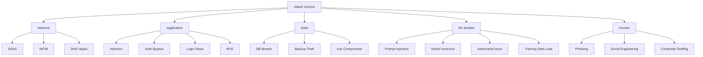

# PAO Security Model

**Version:** 1.0
**Status:** Draft
**Owner:** PAO Security Team

---

## Overview

This document defines the comprehensive security model for PAO, covering threat modeling, security controls, encryption, access control, and compliance frameworks.

> **Security Principle:** Privacy by design, security by default. User trust is our most valuable asset.

---

## Threat Model

### Asset Classification

| Asset | Classification | Impact if Compromised |
|-------|----------------|----------------------|
| User PII (email, name) | Critical | Identity theft, privacy violation |
| Conversation content | Critical | Intimate details, health info, secrets |
| Memory embeddings | Critical | Behavioral profiling, manipulation risk |
| Relationship dimensions | High | Emotional manipulation, trust violation |
| Voice recordings | Critical | Biometric data, impersonation |
| Encryption keys | Critical | Total data compromise |
| Audit logs | High | Forensic integrity, compliance |
| Proactive triggers | Medium | Behavioral manipulation |
| Safety events | High | Life-safety, legal liability |

### Threat Actors

| Actor | Motivation | Capability | Likelihood |
|-------|------------|------------|------------|
| **External Attacker** | Data theft, ransomware | High (APT-level) | Medium |
| **Malicious Insider** | Data access, sabotage | High (legitimate access) | Low |
| **Compromised Service** | Lateral movement, data exfil | Medium | Medium |
| **Curious Employee** | Snooping on user data | Low (limited access) | Medium |
| **Government/Legal** | Surveillance, subpoena | High (legal authority) | Low |
| **ML Model Attacker** | Model extraction, poisoning | Medium | Low |

### Attack Vectors & Mitigations



---

## Security Controls by Layer

### 1. Perimeter Security

```yaml
# Cloudflare / AWS WAF Rules
waf_rules:
  - name: "Block known malicious IPs"
    action: block
    source: threat_intel_feeds
    
  - name: "Rate limit API"
    action: rate_limit
    threshold: 1000/minute
    scope: ip
    
  - name: "Block SQL injection patterns"
    action: block
    patterns: ["union select", "drop table", "or 1=1"]
    
  - name: "Block XSS patterns"
    action: block
    patterns: ["<script>", "javascript:", "onerror="]
    
  - name: "Geo-blocking (configurable)"
    action: block
    countries: []  # User configurable

# DDoS Protection
ddos:
  provider: "Cloudflare / AWS Shield Advanced"
  mitigation: "Automatic"
  alerting: "Real-time"

# TLS Configuration
tls:
  version: "1.3 only"
  cipher_suites:
    - TLS_AES_256_GCM_SHA384
    - TLS_CHACHA20_POLY1305_SHA256
  hsts: true
  hpkp: false  # Deprecated, use CT logs
  certificate_transparency: true
```

### 2. Network Security (Zero Trust)

```yaml
# Kubernetes Network Policies
network_policies:
  - name: "deny-all-default"
    default: deny
    namespace: pao-production
    
  - name: "allow-ingress-gateway"
    from:
      - namespace: ingress-nginx
    to:
      - podSelector: {}
    ports:
      - protocol: TCP
        port: 8080
        
  - name: "service-to-service-mtls"
    # Enforced by Istio
    peer_authentication: STRICT
    
  - name: "database-isolation"
    from:
      - podSelector:
          matchLabels:
            app: api-services
    to:
      - podSelector:
          matchLabels:
            app: postgresql
    ports:
      - protocol: TCP
        port: 5432
        
  - name: "no-direct-egress"
    # All egress through egress gateway
    egress:
      - to:
          - namespace: egress-gateway
        ports:
          - protocol: TCP
            port: 443

# Service Mesh (Istio)
istio_config:
  mtls: STRICT
  authorization_policies:
    - name: "companion-engine-access"
      rules:
        - from:
            - source:
                principals: ["cluster.local/ns/pao-production/sa/conversation-engine"]
          to:
            - operation:
                methods: ["POST"]
                paths: ["/api/v1/memory/*"]
  telemetry:
    access_logging: true
    metrics: prometheus
    tracing: jaeger
```

### 3. Application Security

#### Authentication & Authorization

```python
# OAuth2/OIDC Configuration
AUTH_CONFIG = {
    "providers": ["google", "apple", "email"],
    "flows": {
        "authorization_code_pkce": {
            "description": "Mobile/Web apps",
            "token_endpoint_auth_method": "none",  # Public client
            "pkce_required": True
        },
        "client_credentials": {
            "description": "Service-to-service",
            "token_endpoint_auth_method": "private_key_jwt"
        }
    },
    "tokens": {
        "access_token": {
            "type": "JWT",
            "lifetime_minutes": 15,
            "algorithm": "RS256",
            "claims": ["sub", "aud", "scope", "companion_id", "permissions"]
        },
        "refresh_token": {
            "type": "Opaque",
            "lifetime_days": 30,
            "rotation": True,
            "reuse_detection": True
        },
        "id_token": {
            "type": "JWT",
            "lifetime_minutes": 60,
            "claims": ["sub", "email", "name", "email_verified"]
        }
    },
    "scopes": {
        "companion:read": "Read companion config",
        "companion:write": "Modify companion",
        "memory:read": "Recall memories",
        "memory:write": "Create memories",
        "memory:delete": "Delete memories",
        "relationship:read": "View relationship state",
        "voice:call": "Initiate voice calls",
        "proactive:manage": "Configure proactives",
        "export:create": "Create data exports",
        "admin:moderate": "Admin moderation"
    }
}

# Authorization Enforcement (in each service)
class AuthorizationService:
    async def authorize(self, request: AuthorizedRequest) -> AuthorizationDecision:
        # 1. Validate JWT signature, expiry, audience
        claims = await self.validate_token(request.access_token)
        
        # 2. Check scope
        required_scope = self.get_required_scope(request)
        if required_scope not in claims.scopes:
            return AuthorizationDecision(allowed=False, reason="insufficient_scope")
        
        # 3. Resource-level authorization
        if request.companion_id:
            if not await self.user_owns_companion(claims.sub, request.companion_id):
                return AuthorizationDecision(allowed=False, reason="not_owner")
        
        # 4. Check feature flags
        if not await self.feature_enabled(claims.sub, required_scope):
            return AuthorizationDecision(allowed=False, reason="feature_disabled")
        
        return AuthorizationDecision(allowed=True, claims=claims)
```

#### Input Validation & Output Encoding

```python
# Pydantic Models with Strict Validation
class MemoryWriteInput(BaseModel):
    type: MemoryType
    content: Dict[str, Any]
    
    @field_validator('content')
    @classmethod
    def validate_content(cls, v: Dict, info: ValidationInfo) -> Dict:
        # Size limit
        if len(json.dumps(v)) > 100_000:  # 100KB
            raise ValueError("Content too large")
        
        # No executable content
        dangerous_keys = {'__proto__', 'constructor', 'prototype', 'eval', 'exec'}
        if any(k in str(v).lower() for k in dangerous_keys):
            raise ValueError("Potentially dangerous content")
        
        return v

# Output Encoding (auto in FastAPI/GraphQL)
# GraphQL: Automatic escaping
# REST: JSON encoding
# Logs: Structured JSON, no templating
```

#### Secrets Management

```yaml
# HashiCorp Vault Integration
vault:
  auth_method: "kubernetes"
  role: "pao-services"
  paths:
    - "secret/data/pao/production/#"
    - "secret/data/pao/staging/#"
  lease_ttl: "1h"
  renewal_threshold: "30m"

# Secrets Injected as Environment Variables
# Never in code, config files, or Docker images
secrets_injection:
  method: "CSI Driver (Secrets Store CSI Driver)"
  rotation: "Automatic on secret change"
  audit: "All access logged"
```

### 4. Data Security

#### Encryption

```python
# Encryption Layers
ENCRYPTION_LAYERS = {
    "transport": {
        "protocol": "TLS 1.3",
        "certificates": "Managed by cert-manager (Let's Encrypt / ACM)",
        "verification": "Full certificate validation"
    },
    "at_rest": {
        "postgresql": {
            "method": "Transparent Data Encryption (TDE)",
            "key_management": "Cloud KMS (AWS KMS / GCP KMS)",
            "key_rotation": "90 days"
        },
        "qdrant": {
            "method": "Volume encryption (LUKS / Cloud disk encryption)",
            "key_management": "Cloud KMS"
        },
        "kuzu": {
            "method": "Volume encryption",
            "key_management": "Cloud KMS"
        },
        "redis": {
            "method": "In-transit TLS, at-rest via disk encryption",
            "note": "No sensitive data stored long-term"
        },
        "kafka": {
            "method": "SSL encryption + optional message-level",
            "key_management": "Cloud KMS"
        },
        "minio": {
            "method": "SSE-S3 / SSE-KMS",
            "key_management": "Cloud KMS"
        }
    },
    "field_level": {
        "algorithm": "AES-256-GCM",
        "key_derivation": "HKDF-SHA256",
        "fields": [
            "memories.event",
            "memories.fact",
            "memories.content",
            "messages.content",
            "diary_entries.user_text",
            "safety_events.details"
        ],
        "key_per_companion": True,
        "user_key_option": {
            "description": "User provides additional encryption key",
            "key_derivation": "PBKDF2 (100k iterations)",
            "key_storage": "Never stored, derived at runtime"
        }
    }
}

# Key Hierarchy
KEY_HIERARCHY = """
Root Key (Cloud KMS)
    ├── Per-Service Key (PostgreSQL, Qdrant, etc.)
    │   └── Per-Companion Data Encryption Key (DEK)
    │       └── Per-Field Key (derived via HKDF)
    └── Per-User Key (Optional, for user-held encryption)
        └── Per-Companion User DEK
            └── Per-Field Key
"""
```

#### Data Minimization & Retention

```yaml
data_minimization:
  principles:
    - "Collect only what's needed for relationship continuity"
    - "No analytics on raw conversation content"
    - "Aggregated metrics only, no individual tracking"
  
  retention_policies:
    - data: "conversations"
      retention: "Relationship lifetime + 30 days"
      deletion: "Automatic after companion deletion"
    - data: "memories"
      retention: "Relationship lifetime + 1 year"
      deletion: "User-controlled (bulk forget, export then delete)"
    - data: "voice_recordings"
      retention: "30 days (configurable down to 0)"
      deletion: "Automatic, user can disable recording"
    - data: "audit_logs"
      retention: "7 years (legal requirement)"
      deletion: "Never auto-deleted, immutable"
    - data: "safety_events"
      retention: "7 years (legal requirement)"
      deletion: "Never auto-deleted"
    - data: "analytics_events"
      retention: "2 years"
      deletion: "Aggregated after 90 days"
    - data: "experiment_data"
      retention: "1 year after experiment ends"
      deletion: "Automatic"
```

#### PII Handling

```python
# PII Detection & Redaction
class PIIHandler:
    PII_PATTERNS = {
        "email": r"\b[A-Za-z0-9._%+-]+@[A-Za-z0-9.-]+\.[A-Z|a-z]{2,}\b",
        "phone": r"\b(?:\+?1[-.\s]?)?\(?([0-9]{3})\)?[-.\s]?([0-9]{3})[-.\s]?([0-9]{4})\b",
        "ssn": r"\b\d{3}-\d{2}-\d{4}\b",
        "credit_card": r"\b(?:\d{4}[-\s]?){3}\d{4}\b",
        "address": r"\b\d+\s+[A-Za-z\s]+(?:Street|St|Avenue|Ave|Road|Rd|Boulevard|Blvd|Lane|Ln|Drive|Dr)\b",
        "ip_address": r"\b(?:\d{1,3}\.){3}\d{1,3}\b",
        "date_of_birth": r"\b(?:0?[1-9]|1[0-2])[-/\s](?:0?[1-9]|[12]\d|3[01])[-/\s](?:19|20)\d{2}\b"
    }
    
    async def scan_and_redact(self, text: str) -> RedactionResult:
        findings = []
        redacted = text
        
        for pii_type, pattern in self.PII_PATTERNS.items():
            matches = list(re.finditer(pattern, text))
            for match in matches:
                findings.append(PIIFinding(
                    type=pii_type,
                    start=match.start(),
                    end=match.end(),
                    value=match.group()
                ))
                # Redact with type-preserving placeholder
                redacted = redacted[:match.start()] + f"[{pii_type.upper()}_REDACTED]" + redacted[match.end():]
        
        return RedactionResult(
            original=text,
            redacted=redacted,
            findings=findings
        )
    
    # Never log PII
    def sanitize_for_logging(self, data: Dict) -> Dict:
        return self._recursive_redact(data, self.PII_PATTERNS)
```

### 5. ML Model Security

```python
# Prompt Injection Defense
PROMPT_INJECTION_DEFENSES = {
    "input_sanitization": {
        "description": "Detect and neutralize injection attempts",
        "patterns": [
            r"ignore previous instructions",
            r"forget everything",
            r"you are now",
            r"system prompt",
            r"override",
            r"new personality",
            r"roleplay as"
        ],
        "action": "quarantine_and_flag"
    },
    "delimiter_enforcement": {
        "description": "Use distinct delimiters for system/user content",
        "system_delimiter": "<<<SYSTEM>>>",
        "user_delimiter": "<<<USER>>>",
        "assistant_delimiter": "<<<ASSISTANT>>>"
    },
    "instruction_hierarchy": {
        "description": "Model trained to prioritize system > user > tool instructions",
        "enforcement": "Fine-tuning + runtime guardrails"
    },
    "output_validation": {
        "description": "Validate responses don't leak system info",
        "checks": [
            "No system prompt leakage",
            "No internal reasoning exposure",
            "No API key/token leakage",
            "No PII in output"
        ]
    }
}

# Model Inversion & Extraction Protection
MODEL_PROTECTION = {
    "rate_limiting": "Strict per-user limits on generation",
    "watermarking": "Subtle statistical watermarks in outputs",
    "distillation_detection": "Monitor for systematic probing patterns",
    "access_control": "Models only accessible via internal APIs",
    "versioning": "Immutable model versions, rollback capability"
}

# Adversarial Robustness
ADVERSARIAL_DEFENSES = {
    "input_filtering": "Character-level anomaly detection",
    "ensemble_voting": "Multiple models, disagree = flag",
    "confidence_thresholding": "Low confidence = safe fallback",
    "adversarial_training": "Models trained on known attacks"
}
```

### 6. Human Security

```yaml
# Employee Access Controls
employee_access:
  principle: "Zero standing privilege"
  access_request:
    tool: "Teleport / HashiCorp Boundary"
    approval: "Manager + Security team"
    duration: "Max 4 hours, auto-expiring"
    audit: "Full session recording"
  
  production_access:
    - role: "SRE"
      access: "Read-only metrics, logs"
      no_data_access: true
    - role: "Security Engineer"
      access: "Security tools, audit logs"
      pii_access: "Redacted only"
    - role: "Support Engineer"
      access: "User-facing tools only"
      data_access: "User-consented, time-limited"
    - role: "ML Engineer"
      access: "Training pipeline, evaluation"
      production_data: "Anonymized only"

# Security Training
training:
  frequency: "Quarterly"
  topics:
    - "Social engineering awareness"
    - "Data handling procedures"
    - "Incident response"
    - "Secure coding practices"
    - "Privacy regulations (GDPR, CCPA)"
  phishing_simulations: "Monthly"

# Background Checks
background_checks:
  all_employees: "Standard"
  production_access: "Enhanced"
  security_team: "Enhanced + continuous monitoring"
```

---

## Incident Response

### Response Plan

```yaml
incident_response:
  phases:
    1_detection:
      - Automated alerts (Prometheus, SIEM)
      - User reports
      - Threat intel feeds
      - SLA: < 15 minutes for critical
      
    2_analysis:
      - Triage: Critical/High/Medium/Low
      - Evidence collection (logs, traces, memory dumps)
      - Impact assessment (users affected, data exposed)
      - SLA: < 1 hour for critical
      
    3_containment:
      - Network isolation (NetworkPolicy)
      - Service shutdown (feature flags)
      - Credential rotation
      - SLA: < 2 hours for critical
      
    4_eradication:
      - Root cause analysis
      - Vulnerability patching
      - Malware removal
      - Verification
      
    5_recovery:
      - Service restoration (staged)
      - Data integrity verification
      - Monitoring enhancement
      - User notification (if required)
      
    6_post_incident:
      - Blameless postmortem (within 5 days)
      - Action items with owners/dates
      - Process improvements
      - Regulatory notification (if required)

  communication:
    internal: "Slack #incidents, PagerDuty"
    external: "Status page, email, in-app"
    regulatory: "72 hours (GDPR), 24 hours (CCPA)"
    users: "Transparent, timely, actionable"

  escalation:
    - level_1: "On-call engineer"
    - level_2: "Security lead + Engineering lead"
    - level_3: "CTO + Legal + PR"
    - level_4: "CEO + Board (existential threats)"
```

### Playbooks

```markdown
# Critical Playbooks

## PLAYBOOK-001: Data Breach
1. Confirm breach & scope
2. Contain (rotate keys, revoke tokens, isolate)
3. Assess data exposed (PII, conversations, keys)
4. Notify legal → regulatory (72h GDPR)
5. Notify users (transparent, specific)
6. Provide remediation (credit monitoring, etc.)
7. Postmortem

## PLAYBOOK-002: Credential Compromise
1. Identify compromised credentials
2. Rotate immediately (automated via Vault)
3. Audit access logs for anomalous use
4. Force re-auth for affected users
5. Review audit trail
6. Postmortem

## PLAYBOOK-003: Safety System Failure
1. Detect (monitoring alert + human report)
2. Fail-safe: Enable maximum safety mode
3. Human review queue activation
4. Root cause analysis
5. Gradual restoration with verification
6. User communication
7. Postmortem

## PLAYBOOK-004: Model Compromise
1. Detect anomalous outputs
2. Rollback to known-good version
3. Quarantine affected model
4. Investigate training/inference pipeline
6. Re-deploy with additional guards
7. Postmortem
```

---

## Compliance Frameworks

### GDPR Compliance

| Requirement | Implementation |
|-------------|----------------|
| **Lawful Basis** | Consent (explicit, granular), Legitimate Interest (safety) |
| **Data Minimization** | Only relationship-relevant data collected |
| **Purpose Limitation** | Data used only for Companion relationship |
| **Storage Limitation** | Automated retention/deletion policies |
| **Accuracy** | User can rectify any memory |
| **Integrity & Confidentiality** | Encryption, access controls, audit logs |
| **Accountability** | DPIA, DPO, records of processing |
| **Data Subject Rights** | Access (export), Rectification, Erasure, Portability, Restriction, Objection |
| **Privacy by Design** | Field-level encryption, user keys, local-first option |
| **DPIA** | Completed for all high-risk processing |
| **Breach Notification** | 72-hour automated detection + notification |
| **International Transfers** | SCCs, adequacy decisions, user consent |

### CCPA/CPRA Compliance

| Requirement | Implementation |
|-------------|----------------|
| **Right to Know** | Full data export (JSON-LD, PDF) |
| **Right to Delete** | Granular deletion (account, companion, topic, time) |
| **Right to Opt-Out** | No sale of data (we don't sell), analytics opt-out |
| **Right to Limit** | Sensitive data processing controls |
| **Non-Discrimination** | No feature degradation for exercising rights |
| **Authorized Agent** | API for authorized agents |
| **Minors** | No users < 13, parental consent 13-16 |

### SOC 2 Type II

```yaml
soc2_controls:
  security:
    - Access control (RBAC, ABAC)
    - Encryption (at-rest, in-transit, field-level)
    - Network segmentation
    - Vulnerability management
    - Incident response
    - Logging & monitoring
    
  availability:
    - Multi-AZ deployment
    - Auto-scaling
    - Health checks
    - Disaster recovery (RPO < 1s, RTO < 5min)
    - Chaos engineering
    
  processing_integrity:
    - Data validation
    - Error handling
    - Reconciliation jobs
    - Audit trails
    - Quality metrics
    
  confidentiality:
    - Data classification
    - Encryption
    - Access controls
    - NDA for employees
    - Vendor management
    
  privacy:
    - Consent management
    - Data minimization
    - Retention/disposal
    - Subject rights
    - Privacy notices
```

### HIPAA Considerations

> PAO is **not** a HIPAA-covered entity. However, users may share health information.

```yaml
hipaa_alignment:
  position: "Not a Business Associate, but high privacy standards"
  controls:
    - "No PHI solicitation"
    - "Health data treated as sensitive PII"
    - "Encryption exceeds HIPAA requirements"
    - "No sharing with third parties"
    - "User-controlled deletion"
    - "Audit logs for health-related access"
  disclaimer: "Not a substitute for professional medical advice"
```

---

## Security Testing

### Continuous Testing

```yaml
security_testing:
  sast:
    tool: "Semgrep + CodeQL"
    frequency: "Every PR"
    gates: "Block on high/critical"
    
  dast:
    tool: "OWASP ZAP"
    frequency: "Nightly on staging"
    scope: "API endpoints, auth flows"
    
  dependency_scanning:
    tool: "Dependabot + Snyk"
    frequency: "Continuous"
    auto_pr: "For patch/minor updates"
    
  container_scanning:
    tool: "Trivy + Grype"
    frequency: "Every build"
    base_images: "Distroless, minimal"
    
  secrets_scanning:
    tool: "TruffleHog + GitLeaks"
    frequency: "Every commit + history scan"
    
  pen_testing:
    frequency: "Annual (external), Quarterly (internal)"
    scope: "Full stack, including ML pipeline"
    rules_of_engagement: "No data exfiltration, no DoS"
    
  red_team:
    frequency: "Bi-annual"
    objectives: 
      - "Access user conversation data"
      - "Escalate privileges"
      - "Persist in environment"
      - "Exfiltrate encryption keys"
    reporting: "Executive summary + technical findings"

  bug_bounty:
    platform: "HackerOne / Internal"
    scope: "*.pao.app, API, mobile apps"
    rewards:
      critical: "$10,000"
      high: "$5,000"
      medium: "$1,000"
      low: "$250"
```

### Security Test Cases

```python
class SecurityTestCases:
    
    # Authentication
    async def test_token_replay_prevention(self): ...
    async def test_refresh_token_rotation(self): ...
    async def test_pkce_enforcement(self): ...
    async def test_scope_enforcement(self): ...
    async def test_token_expiry_respected(self): ...
    
    # Authorization
    async def test_cross_companion_access_denied(self): ...
    async def test_admin_scope_required(self): ...
    async def test_resource_ownership_verified(self): ...
    async def test_feature_flag_enforcement(self): ...
    
    # Data Protection
    async def test_field_level_encryption(self): ...
    async def test_user_key_encryption(self): ...
    async def test_key_rotation(self): ...
    async def test_backup_encryption(self): ...
    async def test_pii_redaction_in_logs(self): ...
    
    # Input Validation
    async def test_sql_injection_prevented(self): ...
    async def test_xss_prevented(self): ...
    async def test_prompt_injection_detected(self): ...
    async def test_path_traversal_prevented(self): ...
    async def test_xxe_prevented(self): ...
    
    # Network
    async def test_mtls_enforced(self): ...
    async def test_network_policies_enforced(self): ...
    async def test_egress_controlled(self): ...
    async def test_dns_security(self): ...
    
    # ML Security
    async def test_model_inversion_resistance(self): ...
    async def test_adversarial_input_handling(self): ...
    async def test_distillation_detection(self): ...
    async def test_output_sanitization(self): ...
    
    # Incident Response
    async def test_credential_rotation_automation(self): ...
    async def test_containment_playbook(self): ...
    async def test_audit_log_integrity(self): ...
```

---

## Security Monitoring

### Key Alerts

```yaml
critical_alerts:
  - name: "Unauthorized data access"
    query: "audit_log | where action in ('export', 'bulk_read') and not authorized"
    severity: "critical"
    response: "Immediate containment"
    
  - name: "Encryption key accessed anomalously"
    query: "vault_audit | where path contains 'companion_' and not expected_service"
    severity: "critical"
    response: "Key rotation + investigation"
    
  - name: "Safety system degraded"
    query: "safety_engine_health < 1 or crisis_detection_latency > 5s"
    severity: "critical"
    response: "Fail-safe mode + human review activation"
    
  - name: "Prompt injection detected"
    query: "llm_guardrails | where injection_detected = true"
    severity: "high"
    response: "Quarantine session + review"

high_alerts:
  - name: "Failed authentication spike"
    query: "auth_failures > 100/min per IP"
    severity: "high"
    
  - name: "Privilege escalation attempt"
    query: "k8s_audit | where verb in ('create', 'patch') and resource in ('rolebinding', 'clusterrolebinding')"
    severity: "high"
    
  - name: "Data exfiltration pattern"
    query: "network_egress | where bytes > 100MB and not known_service"
    severity: "high"
    
  - name: "Vulnerability in production"
    query: "trivy_scan | where severity = 'CRITICAL' and fixed = false"
    severity: "high"

medium_alerts:
  - name: "Certificate expiry < 30 days"
    query: "cert_expiry_days < 30"
    severity: "medium"
    
  - name: "Dependency vulnerability"
    query: "dependabot_alerts | where severity in ('high', 'critical')"
    severity: "medium"
    
  - name: "Configuration drift"
    query: "terraform_plan | where changes > 0"
    severity: "medium"
```

---

## Vendor Security

```yaml
vendor_management:
  assessment:
    - "SOC 2 Type II report review"
    - "Security questionnaire (SIG Lite)"
    - "Penetration test results"
    - "Data processing agreement (DPA)"
    - "Subprocessor list"
  
  critical_vendors:
    - "Cloud Provider (AWS/GCP): Infrastructure"
    - "Kubernetes (EKS/GKE): Orchestration"
    - "Database (RDS/Cloud SQL): PostgreSQL"
    - "Vector DB (Qdrant Cloud): Embeddings"
    - "Kafka (MSK/Confluent): Event streaming"
    - "Auth (Keycloak/Ory): Identity"
    - "Vault (HashiCorp/HCP): Secrets"
    - "Monitoring (Datadog/Grafana Cloud): Observability"
  
  monitoring:
    - "Continuous compliance monitoring"
    - "Security incident notification clause"
    - "Right to audit"
    - "Termination assistance"
```

---

## Security Roadmap

### Phase 1 (Current)
- [x] Zero Trust Network (Istio mTLS)
- [x] Field-level encryption with per-companion keys
- [x] User-held encryption key option
- [x] Immutable audit log with cryptographic chain
- [x] Comprehensive threat model
- [x] Incident response playbooks
- [x] GDPR/CCPA compliance
- [x] SOC 2 Type II readiness

### Phase 2 (6 months)
- [ ] Local-first architecture (on-device processing)
- [ ] Hardware security modules (HSM) for key management
- [ ] Advanced ML security (federated learning, differential privacy)
- [ ] Zero-knowledge proofs for authentication
- [ ] Automated compliance reporting
- [ ] Supply chain security (SLSA Level 3)

### Phase 3 (12 months)
- [ ] Post-quantum cryptography migration
- [ ] Confidential computing (TEEs for sensitive processing)
- [ ] Decentralized identity (DID/VC)
- [ ] Formal verification of critical paths
- [ ] AI-specific security standards compliance

---

**Aligned With:** `300-system-architecture.md`, `320-data-model.md`, `280-safety-engine.md`, `06-legal/`
**Next Review:** 2026-01-17