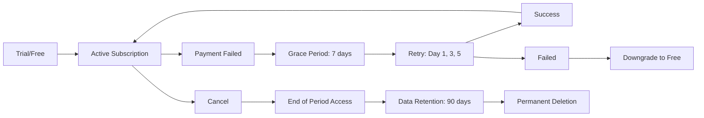

# PAO Pricing & Packaging Strategy

**Version:** 1.0
**Status:** Draft
**Owner:** PAO Product & Business Strategy Team

---

## Overview

This document defines the detailed pricing strategy, packaging architecture, and monetization mechanics for PAO.

> **Pricing Principle:** Price to value, not cost. Simple, transparent, and fair. Users should never feel tricked.

---

## Packaging Architecture

### Tier Structure

```
┌─────────────────────────────────────────────────────────────────────────────┐
│                           PAO PRICING TIERS                                 │
├──────────────┬──────────────┬──────────────┬──────────────┬────────────────┤
│     FREE     │     PRO      │   PREMIUM    │  ENTERPRISE  │   MARKETPLACE  │
│   ($0/mo)    │  ($19/mo)    │   ($49/mo)   │   (Custom)   │   (Rev Share)  │
├──────────────┼──────────────┼──────────────┼──────────────┼────────────────┤
│ Acquisition  │ Core Value   │ Full Value   │ Organization │ Creator Economy│
│ & Habit      │ Individual   │ Power User   │ & Teams      │ & Extensions   │
└──────────────┴──────────────┴──────────────┴──────────────┴────────────────┘
```

### Annual Discounts

| Tier | Monthly | Annual | Discount | Effective Monthly |
|------|---------|--------|----------|-------------------|
| Pro | $19 | $199 | 13% | $16.58 |
| Premium | $49 | $499 | 15% | $41.58 |
| Enterprise | Custom | Custom | 15-20% | Negotiated |

### Regional Pricing (PPP-Adjusted)

```yaml
regional_multipliers:
  tier_1: 1.00   # US, CA, AU, UK, DE, FR, JP, SG
  tier_2: 0.60   # BR, MX, TR, PL, CZ, KR
  tier_3: 0.30   # IN, ID, PH, VN, NG, KE, ZA
  tier_4: 0.15   # AR, EG, PK, BD, VE

# Example: Premium in Tier 3 = $49 * 0.30 = ~$15/mo
# Minimum price floor: $3/mo (prevents arbitrage)
```

---

## Feature Comparison Matrix

### Core Features

| Feature | Free | Pro | Premium | Enterprise |
|---------|------|-----|---------|------------|
| **Companions** | 1 | 3 | 10 | Unlimited |
| **Messages/Day** | 50 | Unlimited | Unlimited | Unlimited |
| **Message History** | 30 days | Unlimited | Unlimited | Unlimited |
| **Memory Retention** | 30 days | Unlimited | Unlimited | Unlimited |
| **Memory Types** | Episodic only | All | All | All + Custom |
| **Recall Limit/Day** | 10 | 100 | Unlimited | Unlimited |

### Voice & Multimodal

| Feature | Free | Pro | Premium | Enterprise |
|---------|------|-----|---------|------------|
| **Voice Calls** | ❌ | ✅ | ✅ | ✅ |
| **Voice Minutes/Month** | 0 | 120 | 500 | Custom |
| **Voice Quality** | - | Standard | HD + Timbre | HD + Custom |
| **Real-time Streaming** | ❌ | ✅ | ✅ | ✅ |
| **Voice Cloning** | ❌ | ❌ | ✅ (1) | ✅ (Unlimited) |
| **Video Calls** | ❌ | ❌ | Beta | ✅ |

### Proactive Engine

| Feature | Free | Pro | Premium | Enterprise |
|---------|------|-----|---------|------------|
| **Proactive Messages/Week** | 3 | 20 | Unlimited | Unlimited |
| **Trigger Categories** | Basic (3) | All (8) | All + Custom | All + Custom |
| **Milestone Detection** | ❌ | ✅ | ✅ | ✅ |
| **Proactive Scheduling** | ❌ | Basic | Advanced | Advanced |
| **Feedback Loop** | Basic | Full | Full + Analytics | Full + API |

### Relationship & Insights

| Feature | Free | Pro | Premium | Enterprise |
|---------|------|-----|---------|------------|
| **RHI Score** | Basic | Full | Full + History | Full + Dashboard |
| **Relationship Dimensions** | 3 | 6 | 6 + Custom | 6 + Custom |
| **Diary/Journal** | ❌ | ✅ | ✅ | ✅ |
| **Insights Reports** | Monthly | Weekly | Daily + Real-time | Real-time + API |
| **Growth Recommendations** | ❌ | ✅ | ✅ + AI Coach | ✅ + Human Coach |

### Customization & Control

| Feature | Free | Pro | Premium | Enterprise |
|---------|------|-----|---------|------------|
| **Personality Presets** | 3 | 10 | All + Marketplace | All + Custom |
| **Custom Personality** | ❌ | Basic | Advanced | Full (Fine-tuned) |
| **Appearance/Avatar** | Basic | Advanced | Premium + 3D | Custom Brand |
| **Language Support** | EN only | 10 langs | 50+ langs | All + Custom |
| **Data Export** | ❌ | ✅ (JSON) | ✅ (All formats) | ✅ (Automated) |
| **API Access** | ❌ | ❌ | ✅ (Rate limited) | ✅ (Full) |

### Safety & Privacy

| Feature | Free | Pro | Premium | Enterprise |
|---------|------|-----|---------|------------|
| **Crisis Detection** | ✅ | ✅ | ✅ | ✅ |
| **Intervention Level** | Standard | Enhanced | Maximum | Configurable |
| **Data Encryption** | At rest | At rest + Transit | E2E Optional | E2E Required |
| **Data Residency** | ❌ | ❌ | ❌ | ✅ |
| **Audit Logs** | ❌ | ❌ | ❌ | ✅ |
| **SSO/SAML** | ❌ | ❌ | ❌ | ✅ |
| **Admin Console** | ❌ | ❌ | ❌ | ✅ |

### Support & Success

| Feature | Free | Pro | Premium | Enterprise |
|---------|------|-----|---------|------------|
| **Support Channel** | Community | Email (48h) | Priority Email (4h) + Chat | Dedicated CSM |
| **SLA** | Best effort | 99% uptime | 99.9% uptime | 99.99% + SLA |
| **Onboarding** | Self-serve | Guided | White-glove | Custom |
| **Training** | Docs | Webinars | 1:1 sessions | Custom program |
| **Account Manager** | ❌ | ❌ | ❌ | ✅ |

---

## Usage-Based Pricing (Overages)

### Voice Minutes

```yaml
voice_overage:
  pro:
    included: 120 minutes/month
    overage_rate: $0.10/minute
    cap: $30/month (then unlimited)
  
  premium:
    included: 500 minutes/month
    overage_rate: $0.08/minute
    cap: $50/month (then unlimited)
  
  enterprise:
    included: Negotiated
    overage_rate: $0.05/minute
    volume_discount: >10k min = $0.03/min
```

### API Calls

```yaml
api_pricing:
  free_tier: 10,000 calls/month
  pro: Not available
  premium:
    included: 100,000 calls/month
    overage: $0.50 per 1,000 calls
  
  enterprise:
    included: 1,000,000 calls/month
    overage: $0.30 per 1,000 calls
    volume_tiers:
      - 10M+: $0.20/1k
      - 100M+: $0.10/1k
```

### Proactive SMS/WhatsApp

```yaml
proactive_messaging:
  premium_included: 100 messages/month
  overage: $0.05/message
  enterprise: Negotiated wholesale rates
```

### Avatar Generation

```yaml
avatar_generation:
  free: 1/month (basic)
  pro: 5/month (premium styles)
  premium: 20/month (all styles + 3D)
  enterprise: Unlimited + custom models
  marketplace_purchase: $2-50 per avatar (70/30 split)
```

### Data Export

```yaml
data_export:
  free: Not available
  pro: 1/month (JSON)
  premium: Unlimited (JSON, PDF, CSV, Markdown)
  enterprise: Automated scheduled exports + API
  one_time_purchase: $5/export (for free/pro users)
```

---

## Billing Mechanics

### Subscription Lifecycle



### Payment Methods

| Method | Supported | Fees | Regions |
|--------|-----------|------|---------|
| Credit/Debit Card | ✅ | 2.9% + $0.30 | Global |
| Apple Pay / Google Pay | ✅ | Same as card | Global |
| PayPal | ✅ | 3.4% + $0.30 | Global |
| Bank Transfer (ACH/SEPA) | Enterprise only | $0.80 | US/EU |
| Invoice (Net 30) | Enterprise only | - | Global |
| Crypto (USDC) | ✅ | 1% | Global |
| Regional (PIX, UPI, Alipay) | ✅ | Local rates | BR, IN, CN |

### Proration Policy

```yaml
proration:
  upgrade: Immediate, prorated charge
  downgrade: End of billing period, no refund
  cancel: Access until period end, no refund
  pause: Not supported (cancel/resubscribe)
  
  # Fair use: If upgrade > 75% through period, 
  # charge full price but extend period
```

### Trial Policy

```yaml
trials:
  pro:
    duration: 14 days
    requires_card: Yes
    auto_convert: Yes
    reminder: Day 10, Day 13
    limit: 1 per user lifetime
  
  premium:
    duration: 30 days
    requires_card: Yes
    auto_convert: Yes
    reminder: Day 20, Day 27
    limit: 1 per user lifetime
  
  enterprise:
    duration: 60 days (pilot)
    requires_card: No (contract)
    auto_convert: No (manual)
    includes: Implementation support
```

---

## Discounts & Promotions

### Standard Discounts

```yaml
discounts:
  annual:
    pro: 13% ($199 vs $228)
    premium: 15% ($499 vs $588)
    enterprise: 15-20%
  
  student:
    eligibility: ".edu email or verification"
    discount: 50% off Pro ($9.50/mo)
    duration: 12 months, renewable
    limit: 4 years total
  
  nonprofit:
    eligibility: "501(c)(3) or equivalent"
    discount: 50% off Premium
    seats: Up to 10
    application: Required
  
  senior:
    eligibility: "Age 65+ verified"
    discount: 30% off Pro ($13.30/mo)
    verification: ID upload (auto-delete after)
  
  referral:
    referrer: 2 months free
    referee: 2 months free
    limit: 12 months free per year
    anti_fraud: Must be active paid user
```

### Promotional Campaigns

```yaml
promotions:
  launch_week:
    discount: "50% off first 3 months"
    code: "LAUNCH50"
    limit: First 1,000 users
  
  black_friday:
    discount: "40% off annual"
    duration: "Nov 24-30"
    stacks_with: "Annual discount (total 47% off)"
  
  new_year:
    discount: "3 months free on annual"
    duration: "Jan 1-15"
    message: "New year, new companion"
  
  mental_health_awareness:
    month: "May"
    discount: "Free Premium for students/nonprofits"
    partner: "Mental health orgs"
  
  world_seniors_day:
    date: "Oct 1"
    discount: "Free Premium for 65+ (1 year)"
    partner: "AARP, Age UK"
```

---

## Packaging Strategy by Segment

### Individual Consumers

```yaml
consumer_strategy:
  free_to_pro:
    trigger: "Hits message limit 3x in week"
    message: "Keep the conversation going unlimited"
    incentive: "14-day trial + 20% off first year"
  
  pro_to_premium:
    trigger: "Uses >80 voice mins OR >50 recalls OR creates 2+ companions"
    message: "Unlock HD voice, unlimited memories, family sharing"
    incentive: "30-day Premium trial"
  
  family_plan:
    target: "Premium users with family"
    packaging: "5 seats for $79/mo (vs $245)"
    positioning: "Shared memories, private companions"
```

### Enterprise (B2B)

```yaml
enterprise_packages:
  starter:
    name: "PAO Team"
    seats: 10-50
    price: "$500/mo base + $15/seat"
    features: ["Admin console", "SSO", "Audit logs", "Priority support"]
    target: "Small clinics, coaching practices"
  
  professional:
    name: "PAO Professional"
    seats: 50-500
    price: "$2,000/mo base + $12/seat"
    features: ["Starter +", "Data residency", "Custom integrations", "CSM"]
    target: "Mid-size healthcare, EAP providers"
  
  enterprise:
    name: "PAO Enterprise"
    seats: 500+
    price: "Custom (starting $10k/mo)"
    features: ["Professional +", "Dedicated infra", "Custom models", "SLA", "On-prem option"]
    target: "Health systems, insurance, government"
  
  platform:
    name: "PAO Platform"
    type: "API-first"
    price: "Volume-based + revenue share"
    features: ["White-label", "Embedded companions", "Marketplace access"]
    target: "App developers, hardware makers, telcos"
```

### Marketplace (Creator Economy)

```yaml
marketplace_model:
  revenue_share:
    creator: 70%
    platform: 30%
    payment_processing: Deducted from platform share
  
  pricing_freedom:
    min_price: $0 (free)
    max_price: $100 (one-time) or $20/mo (subscription)
    platform_approval: >$50 requires review
  
  categories:
    companion_templates:
      typical_price: $10-30
      examples: ["CBT Therapist", "Language Tutor", "Writing Coach"]
    
    personality_packs:
      typical_price: $2-10
      examples: ["Stoic", "Cheerleader", "Grandparent", "Sci-Fi"]
    
    voice_models:
      typical_price: $20-100
      examples: ["Celebrity (licensed)", "Accent packs", "Age variants"]
    
    plugins:
      typical_price: Free - $10/mo
      examples: ["Calendar sync", "Fitbit integration", "Smart home"]
  
  payouts:
    schedule: Monthly (Net 30)
    minimum: $25
    tax_forms: Auto-generated (1099-K, W-8BEN)
```

---

## Price Testing Framework

### Experimentation Methodology

```yaml
testing_framework:
  methodology: "A/B/n testing with statistical significance"
  minimum_sample: 1,000 per variant
  duration: Minimum 14 days (full weekly cycles)
  significance: 95% confidence, 80% power
  guardrail_metrics: 
    - "Signup rate (don't drop >5%)"
    - "Activation rate (don't drop >3%)"
    - "Support ticket volume (don't increase >20%)"
  
  test_categories:
    price_points:
      - "Pro: $15 vs $19 vs $22 vs $25"
      - "Premium: $39 vs $49 vs $59 vs $69"
    
    packaging:
      - "Voice minutes: 60 vs 120 vs 200"
      - "Companions: 2 vs 3 vs 5"
      - "Memory days: 30 vs 90 vs unlimited"
    
    discounts:
      - "Annual: 10% vs 15% vs 20%"
      - "Student: 40% vs 50% vs 60%"
    
    trial:
      - "Duration: 7 vs 14 vs 30 days"
      - "Card required: Yes vs No"
      - "Trial features: Full vs Limited"
    
    billing:
      - "Monthly vs Annual default"
      - "Proration: Immediate vs End of period"
```

### Current Test Roadmap

```yaml
active_tests:
  - name: "Pro Price Elasticity"
    variants: [$15, $19, $22, $25]
    hypothesis: "$19 optimal (charm pricing + value perception)"
    status: "Running"
    end_date: "2025-02-15"
  
  - name: "Premium Voice Inclusion"
    variants: [120, 200, 300, 500 minutes]
    hypothesis: "300 minutes maximizes upgrade from Pro"
    status: "Planning"
  
  - name: "Free Tier Limits"
    variants: [30, 50, 75 messages/day]
    hypothesis: "50 maximizes activation without cannibalizing Pro"
    status: "Completed - 50 won"
  
  - name: "Annual Discount Depth"
    variants: [10%, 15%, 20%, 25%]
    hypothesis: "15% balances revenue and commitment"
    status: "Completed - 15% won"

planned_tests:
  - "Family plan pricing ($59 vs $79 vs $99)"
  - "Enterprise seat pricing (linear vs volume discount)"
  - "Marketplace revenue share (70/30 vs 80/20 vs 60/40)"
  - "Trial length impact on LTV (14 vs 30 vs 60 days)"
```

---

## Financial Modeling

### Revenue Projections (Year 1-3)

```yaml
assumptions:
  user_growth:
    year_1: 50,000 MAU
    year_2: 250,000 MAU
    year_3: 1,000,000 MAU
  
  tier_mix:
    year_1: {free: 70%, pro: 20%, premium: 8%, enterprise: 2%}
    year_2: {free: 55%, pro: 25%, premium: 12%, enterprise: 5%, marketplace: 3%}
    year_3: {free: 45%, pro: 30%, premium: 15%, enterprise: 5%, marketplace: 5%}
  
  annual_vs_monthly:
    pro: 40% annual
    premium: 50% annual
    enterprise: 100% annual
  
  churn_monthly:
    free: 15%
    pro: 3%
    premium: 2%
    enterprise: 0.5%
  
  expansion:
    pro_to_premium: 15%/year
    premium_seat_expansion: 25%/year
    enterprise_expansion: 50%/year

projected_arr:
  year_1: $1.2M
  year_2: $8.5M
  year_3: $45M
  
revenue_mix_year_3:
  subscriptions: 80%
  usage_overages: 10%
  marketplace: 10%
```

### Unit Economics by Tier

```yaml
unit_economics:
  free:
    cac: $5
    ltv: $0 (direct)
    indirect_ltv: $45 (referrals, data, brand)
    payback: N/A
  
  pro:
    cac: $45
    arr: $199
    ltv: $400 (24 months @ 3% churn)
    ltv_cac: 8.9x
    payback_months: 2.4
    gross_margin: 75%
  
  premium:
    cac: $120
    arr: $499
    ltv: $1,200 (30 months @ 2% churn)
    ltv_cac: 10x
    payback_months: 2.4
    gross_margin: 80%
  
  enterprise:
    cac: $5,000
    arr: $50,000
    ltv: $200,000 (48 months @ 0.5% churn)
    ltv_cac: 40x
    payback_months: 12
    gross_margin: 85%
```

---

## Legal & Compliance

### Price Transparency

```yaml
transparency_requirements:
  - "All prices include taxes (where required by law)"
  - "No hidden fees - overages clearly communicated"
  - "Cancel anytime, no questions asked"
  - "Prorated refunds for unused annual portions (EU)"
  - "Clear upgrade/downgrade paths in-app"
  - "Price change notice: 30 days (60 days for enterprise)"
```

### Regional Compliance

```yaml
regional_rules:
  eu:
    - "VAT included_in_price: true"
    - "14-day withdrawal right (digital content exception applies)"
    - "No auto-renewal without explicit consent"
    - "Easy cancellation (same steps as signup)"
  
  california:
    - "Clear cancellation method"
    - "No dark patterns"
    - "Annual renewal notice 15-30 days prior"
  
  brazil:
    - "PIX payment support"
    - "Consumer protection code compliance"
    - "Portuguese language required"
  
  india:
    - "UPI/Rupay support"
    - "GST invoices auto-generated"
    - "RBI recurring mandate compliance"
  
  japan:
    - "JPY pricing (no foreign currency)"
    - "Convenience store payment (Konbini)"
    - "Act on Specified Commercial Transactions"
```

---

## Migration & Grandfathering

### Price Increase Policy

```yaml
price_changes:
  existing_users:
    notice_period: 60 days
    grandfathering: 12 months at old price
    communication: "Email + in-app + blog post"
    option_to_downgrade: Yes, anytime
  
  new_users:
    effective: Immediately
    communication: "Updated pricing page"
  
  enterprise:
    notice_period: 90 days
    contract_honored: Full term
    renewal_at_new_price: Yes
```

### Plan Migration Rules

```yaml
migrations:
  free_to_pro: Immediate, prorated
  pro_to_premium: Immediate, prorated
  premium_to_pro: End of period
  pro_to_free: End of period
  any_to_enterprise: Contract start date
  enterprise_to_other: Contract end date
  
  # Data preservation
  data_on_downgrade:
    memories: "Read-only access, no new writes"
    voice: "Disabled"
    export: "One-time free export"
    grace_period: "30 days before hard limits"
```

---

## Success Metrics for Pricing

```yaml
pricing_kpis:
  # Revenue
  - "ARR growth MoM > 10%"
  - "Net Revenue Retention > 120%"
  - "ARPU > $8.60"
  
  # Conversion
  - "Free-to-Paid > 8%"
  - "Pro-to-Premium > 15%/year"
  - "Trial-to-Paid > 25%"
  
  # Packaging
  - "Feature adoption: Premium features > 60% of Premium users"
  - "Overage revenue < 15% of total (indicates good packaging)"
  - "Downgrade rate < 5%/month"
  
  # Health
  - "Price complaints < 0.1% of tickets"
  - "Chargeback rate < 0.5%"
  - "Refund rate < 2%"
  
  # Experimentation
  - "Test velocity: 2 pricing tests/quarter"
  - "Win rate: > 50% of tests implement positive change"
  - "Revenue per test: > 2% lift on average"
```

---

## Roadmap

### Q1 2025
- [ ] Launch Pro/Premium tiers
- [ ] Implement regional pricing
- [ ] Student/Nonprofit verification
- [ ] Annual billing with proration

### Q2 2025
- [ ] Family plan launch
- [ ] Enterprise self-serve (up to 50 seats)
- [ ] Marketplace beta (invite creators)
- [ ] Usage-based billing for API

### Q3 2025
- [ ] Marketplace public launch
- [ ] Enterprise SSO/SAML
- [ ] Volume discounts automated
- [ ] Partner portal for resellers

### Q4 2025
- [ ] Dynamic pricing experiments
- [ ] AI-powered upgrade prompts
- [ ] Lifetime value prediction model
- [ ] International pricing optimization

---

**Aligned With:** `500-business-model.md`, `510-go-to-market.md`, `170-roadmap.md`
**Next Review:** 2026-01-17